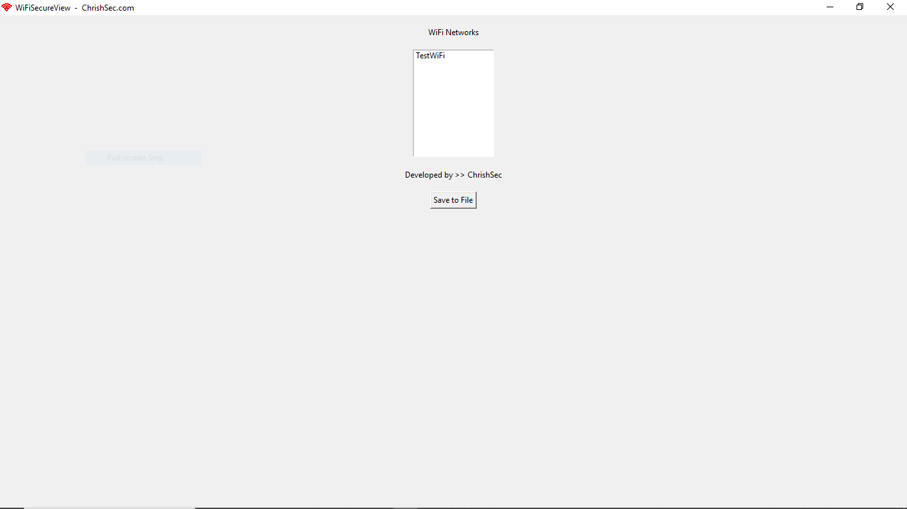
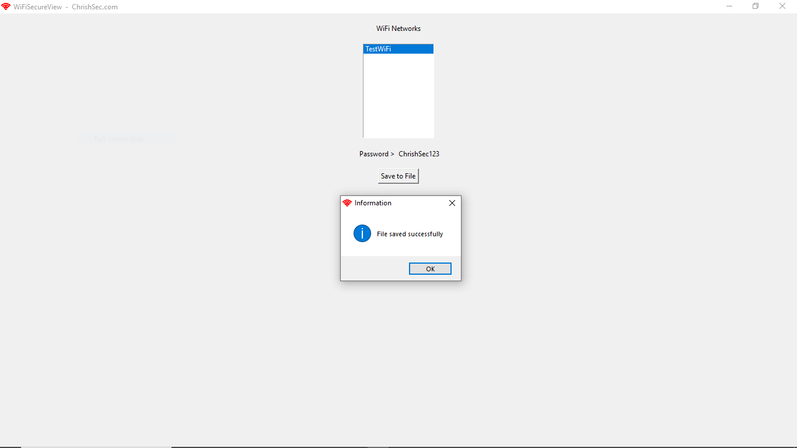
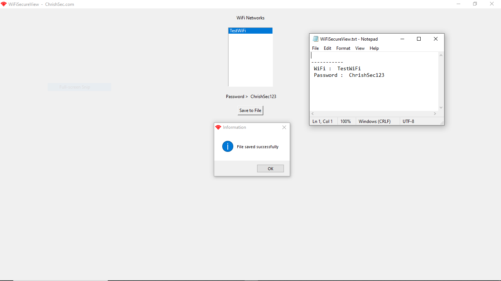

## WiFiSecureView

WiFiSecureView is a simple Tool that allows you to view available WiFi networks and retrieve their passwords on Windows.

### Usage

1. Download the `WiFiSecureView.exe` file from the [releases](https://github.com/ChrishSec/WiFiSecureView/releases/download/v1.0.0/WiFiSecureView_1.0.0.zip) page.
2. Run the `WiFiSecureView.exe` file.
3. A window will display a list of available WiFi networks.
4. Select a network from the list to view its password.
5. Click the "Save to File" button to save WiFi network information to a text file (`WiFiSecureView.txt`).

### Screenshots

## Disclaimer

This Tool is intended for educational and research purposes only. Use it at your own risk. The author is not responsible for any damage caused by the use or misuse of this Tool.

## License

This Tool is released under the GNU General Public License v3.0. Everyone is permitted to copy and distribute verbatim copies of this license document, but changing it is not allowed.

## Author

This Tool was developed by [ChrishSec](https://github.com/ChrishSec). Feel free to fork, modify, and distribute it. If you have any questions or suggestions, please reach out to the author on [Telegram](https://t.me/ChrishSec).
